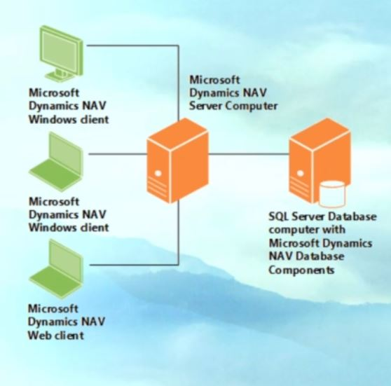
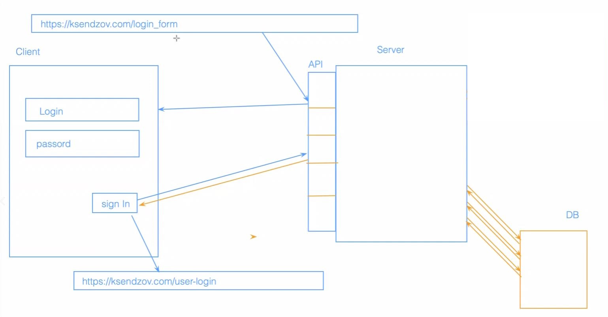

# Клиент-серверная архитектура
-- это архитектура в которой сетевая нагрузка распределяется между поставщиками услуг (сервер) и заказчиками услуг (клиент)

**клиент и сервер** - это программы которые взаимодействуют между собой через сетевые протоколы, самый распространётнный среди них - HTTP. данные программы могут быть расположены на одной или на разных вычислительных машинах 

если мы взглянем на схему то увидим что: 
+ у нас есть клиент 
+ есть сервер 
+ и есть сервер базы данных, 

это и есть стандартная схема клиента и сервера. иногда базы данных в схеме нет и мы говорим о том что есть клиент и сервер взаимодействующие между собой. клиент отправляет http запрос либо http reqest на сервер. сервер его обрабатывает и отправляет клиенту http response ответ от сервера.

если в эту схему добавить базу данных то здесь всё просто:
1. клиент отправляет запрос на сервер
2. сервер отправзяет запрос на базу данных
3. база данных отправляет ответ на сервер 
4. и затем сервер взаимодействует с клиентом отправляя ответ по той информации которую он запросил себе на клиент

тк одна программа сервера может выполнять запросы от нескольких программ клиентов, то эту программу-сервер обычно размещают на специально выделенной вычислительной машине как правило с какими-то другими программами-серверами, поэтому производительность данной машины должна быть очень высокой

### Приемущества данной модели:

+ к плюсам можно отнести отсутствие дублирование кода программы-сервера и программы-клиента т.к. все вычисления выполняются на сервере то требование к пк клиента снижается 

+ как я уже сказал раньше обычно программы-серверы находятся на более вычислительных машинах чем программы клиенты. 

+ так же к плюсу можно отнести то что все данные хранятся на сервере который как правило хорошо защищён, лучше чем большинство клиентов. и на сервере проще организовать контроль полномочий, чтобы разрешать доступ к данным только клиентам с соответстующими правами доступа. обычно этим занимается отдельный человек - системный администратор или девопс.

### Недостатки 

+ недостатками данного вида архитектуры, является то, что если у нас не работает сервер, то вся вычислительная сеть так же не будет работать.
+ для поддержки данной системы требуется отдельный специалист - системный администратор 
+ обычно серверное оборудование стоит очень дорого 

### Трёхуровневая системная архитектура

так же говоря о клиентах и серверах стоит поговорить о такназываемой трёхуровневой системной архитектуре, то есть если у нас в звене есть только клиент и сервер, то такая архитектура - двухуровневая. но когда у нас появляется база данных, то в таких схемах серверу необходимо обратиться к ней чтобы получить данную информацию. 

# выбери другой пример! - например если мы говорим о какой-то социальной сети где клиент отправляет информацию на сервер с запросом поиска информации и эта информация содержится в базе данных

то есть у нас добавляется дополнительное звено - база данных и её сервер и схема хождения сигналов меняется - информация с базы данных уходит обратно на сервер и через сервер попадает обратно на клиент

часто на собеседованиях просят нарисовать схему клиент- серверной архитектуры, поэтому нужно запомнить чем отличается двухуровневая и трёхуровневая система

### Клиент

самым распространённым прмером клиента является браузер. то есть мы вводим какие то наши HTTP запросы по сути это то что мы вводим в адресную строку и этот запрос уходит на сервер - вот это и есть клиент

### Тонкий и толстый клиенты

**тонкий клиент** - компьютер либо же какая то программа-клиент в сети с клиент серверной архитектурой, который переносит большую часть задач по обработке информации на сервер

примером такого тонкого клиента может быть браузер, который используется для работы с веб приложениями. почему его называют тонким клиентом? потому что вся основная бизнес логика, все вычислительные мощности у нас расположены на компьютере сервера. а клиент по сути это какое-то простое програмное обеспечение которое помогает нам отправляь запросы на сервер.

если мы говорим от **толстом клиенте**, то это такое приложение которое обеспечивает расширенную функциональность независимо от центрального сервера

часто сервер в этом случае является лишь хранилищем данных, а вся работа по обработке и представлению этих данных переносится на машину клиента. 
например если взять такое сложное ПО как 1с бухгалтерия это приложение позволяет вести весь бухгалтерский учёт на предприятии. в нём содержится вся основная бизнес логика. а на сервер передаётся только те данные которые необходимо сохранить в базе данных. и когда нам будет необходимо их получить данные, отправляем запрос и получаем данные с базы данных. а всё остальное основное находится именно вот на этом толстом клиенте в 1с клиента

так же к толстому клиенту можно отнести все онлайн игры, там всё в основном находится на клиенте. клиент это и есть наша компьютерная игра. а информация о пользователях - это то что храниться в базе данных у нас на сервере, то есть на сервере не такая сложная вычислительная мощность которая содержит в себе всю основную бизнес логику приложения.

это основные примеры толстово и тонкого клиента.

итак, различают два типа клиентов тонкий и толстый. часто на собеседованиях просят привести примеры тонких и толстых клиентов, рассказать что это такое, поэтому обязательно запоминайте чтобы в дальнейшем не растеряться на техническом интервью. иногда достаточно просто назвать эти примеры без уточнений по поводу того какая бизнес логика содержится в толстом и тонком клиенте

### веб-сайты 

-- носят информационный характер, т.е. состоят из неких веб-страниц объединённых друг с другом в единый ресурс. имеют простую архитктуру на основе HTML кода.

основная информация с сервера на клиент это - разметки на сайте. такие сайты служат в качестве платформы для предоставления контента для посетителей, они содержат текстовые файлы, изображения, музыку.

сайты не предоставляют возможность взаимодействия с нашей программой, то есть пользователи не имеют доступа к размещению своей информации, кроме как заполнения формы для получения подписки.

наиболее яркими примерами типичных сайтов могут быть новостные сайты, кулинарные, прогнозы погоды.

# Вебприложения
-- это  интерактивные компьютерные приложения разработанные для интернета которые позволяют пользователям вводить, получать и манипулировать данными с помощью взаимодействия. 

Вебприложения имеют очень тесную связь с сервером. и отправляют на него очень много запросов. такие веб приложения могут быть встроены в веб-сайты. либо же сами веб-сайты могут являться приложениями. 

примеры - соцсети, почты, ютуб, ebay, ozon

+ веб приложения используют имя пользователя и пароль для аутинтификации.
+ позволяют своим посетителям обмениваться мнгновенными сообщениями если мы говорим о соцсетях либо же каких то блогах. 
+ создавать контент на основе пользовательских предпочтений. 
+ обеспечивать к нему неограниченный доступ, так же там могут быть всроенные мини-программы для развлечений. 

Ключевое отличие от веб-сайтов: многие интернет приложения могут не иметь реального информативного содержания что-же это значит? то есть они используются для выполнения каких то дополнительных задач. т.е. это могут быть интернет переводчики, мессенджеры, конвертёры файлов, конвертёры валют, всё что угодно.

# вебсервисы 

логика интеграционного уровня привязана к вебсервисам.
вебсервис - прикладной программный интерфейс API который работает на сервере и предоставляет клиенту данные через HTTP протокол, через стандартизированный обмен сообщениями, веб сервисы подразделяются на SOAP и REST опять же о протоколе SOAP и архитектурном стиле REST мы поговорим с вами на одном из последующих уроков. 

в современном сценарии большинство сервисов предпочитают использовать архитектурный стиль REST а не протокол SOAP. 

т.к. SOAP стандартизированный, а REST более гибкий, нет строгих правил по которым мы должны с ним сотрудничать и его использовать, поэтому он более интересен с точки зрения веб-разработки 

так как SOAP является стандартизированным протоколом. он использует XML (расширенный язык разметки, похож на язык разметки HTML). объём информации в SOAP конечно намного больше чем в REST - тут мы используем JSON и объём информации намного меньше, за счёт чего сокращается время обработки запросов и ответов с сервера.

итог:  
+ вебсайты - простые веб страницы которые представляют собой информационную нагрузку. + веб приложения - позволяют пользователю взаимодействовать с разными веб страницами, вводить данные, взаимодействовать с контентом.
+ вебсервис это по сути API, какой-то прикладной интерфейс программы который позволяет различным веб-приложениям взаимодействовать между собой 

