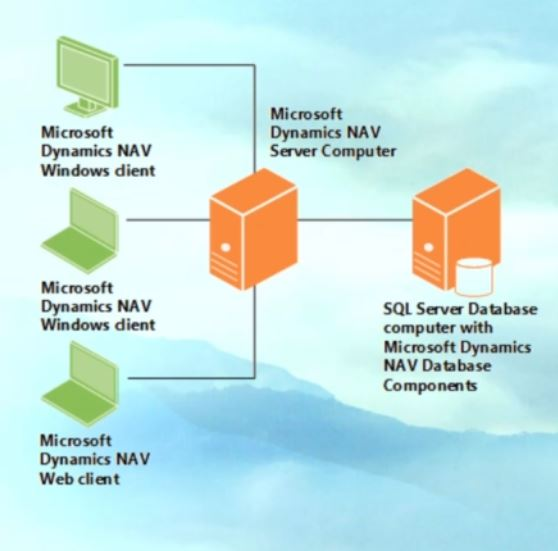
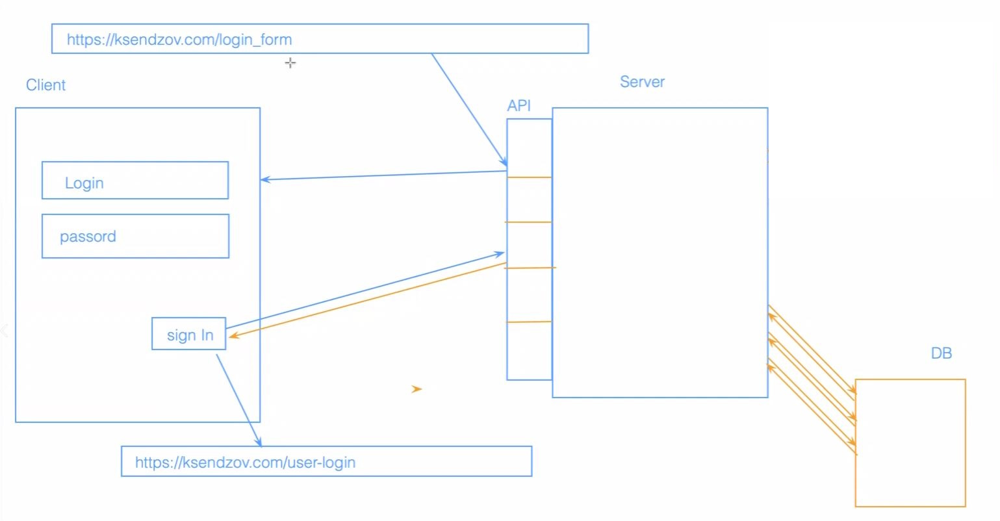
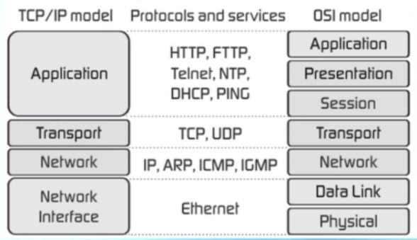
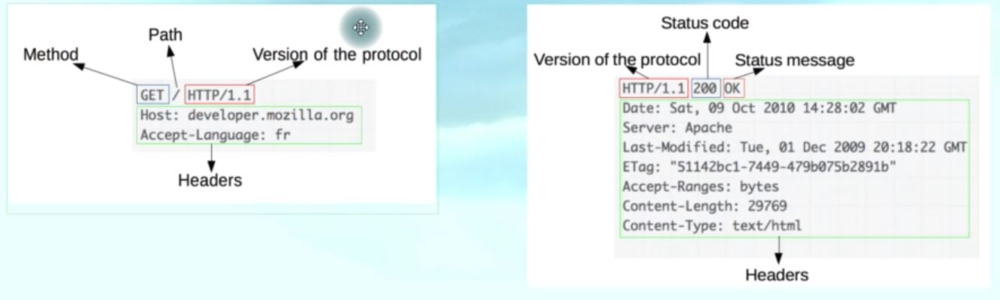
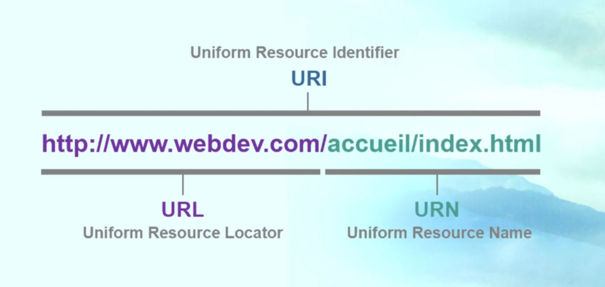
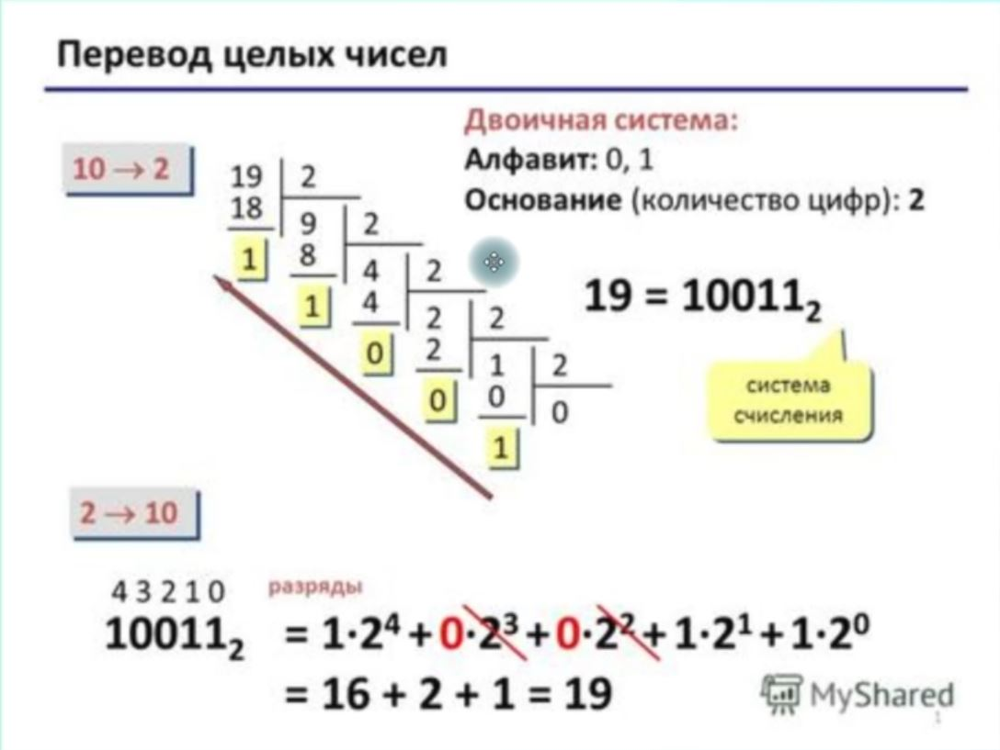

# Клиент-серверная архитектура
-- это архитектура в которой сетевая нагрузка распределяется между поставщиками услуг (сервер) и заказчиками услуг (клиент)

**клиент и сервер** - это программы которые взаимодействуют между собой через сетевые протоколы, самый распространётнный среди них - HTTP. данные программы могут быть расположены на одной или на разных вычислительных машинах 

если мы взглянем на схему то увидим что: 
+ у нас есть клиент 
+ есть сервер 
+ и есть сервер базы данных, 

это и есть стандартная схема клиента и сервера. иногда базы данных в схеме нет и мы говорим о том что есть клиент и сервер взаимодействующие между собой. клиент отправляет http запрос либо http reqest на сервер. сервер его обрабатывает и отправляет клиенту http response ответ от сервера.

если в эту схему добавить базу данных то здесь всё просто:
1. клиент отправляет запрос на сервер
2. сервер отправзяет запрос на базу данных
3. база данных отправляет ответ на сервер 
4. и затем сервер взаимодействует с клиентом отправляя ответ по той информации которую он запросил себе на клиент

тк одна программа сервера может выполнять запросы от нескольких программ клиентов, то эту программу-сервер обычно размещают на специально выделенной вычислительной машине как правило с какими-то другими программами-серверами, поэтому производительность данной машины должна быть очень высокой

### Приемущества данной модели:

+ к плюсам можно отнести отсутствие дублирование кода программы-сервера и программы-клиента т.к. все вычисления выполняются на сервере то требование к пк клиента снижается 

+ как я уже сказал раньше обычно программы-серверы находятся на более вычислительных машинах чем программы клиенты. 

+ так же к плюсу можно отнести то что все данные хранятся на сервере который как правило хорошо защищён, лучше чем большинство клиентов. и на сервере проще организовать контроль полномочий, чтобы разрешать доступ к данным только клиентам с соответстующими правами доступа. обычно этим занимается отдельный человек - системный администратор или девопс.

### Недостатки 

+ недостатками данного вида архитектуры, является то, что если у нас не работает сервер, то вся вычислительная сеть так же не будет работать.
+ для поддержки данной системы требуется отдельный специалист - системный администратор 
+ обычно серверное оборудование стоит очень дорого 

### Трёхуровневая системная архитектура

так же говоря о клиентах и серверах стоит поговорить о такназываемой трёхуровневой системной архитектуре, то есть если у нас в звене есть только клиент и сервер, то такая архитектура - двухуровневая. но когда у нас появляется база данных, то в таких схемах серверу необходимо обратиться к ней чтобы получить данную информацию. 

# выбери другой пример! - например если мы говорим о какой-то социальной сети где клиент отправляет информацию на сервер с запросом поиска информации и эта информация содержится в базе данных

то есть у нас добавляется дополнительное звено - база данных и её сервер и схема хождения сигналов меняется - информация с базы данных уходит обратно на сервер и через сервер попадает обратно на клиент

часто на собеседованиях просят нарисовать схему клиент- серверной архитектуры, поэтому нужно запомнить чем отличается двухуровневая и трёхуровневая система

### Клиент

самым распространённым прмером клиента является браузер. то есть мы вводим какие то наши HTTP запросы по сути это то что мы вводим в адресную строку и этот запрос уходит на сервер - вот это и есть клиент

### Тонкий и толстый клиенты

**тонкий клиент** - компьютер либо же какая то программа-клиент в сети с клиент серверной архитектурой, который переносит большую часть задач по обработке информации на сервер

примером такого тонкого клиента может быть браузер, который используется для работы с веб приложениями. почему его называют тонким клиентом? потому что вся основная бизнес логика, все вычислительные мощности у нас расположены на компьютере сервера. а клиент по сути это какое-то простое програмное обеспечение которое помогает нам отправляь запросы на сервер.

если мы говорим от **толстом клиенте**, то это такое приложение которое обеспечивает расширенную функциональность независимо от центрального сервера

часто сервер в этом случае является лишь хранилищем данных, а вся работа по обработке и представлению этих данных переносится на машину клиента. 
например если взять такое сложное ПО как 1с бухгалтерия это приложение позволяет вести весь бухгалтерский учёт на предприятии. в нём содержится вся основная бизнес логика. а на сервер передаётся только те данные которые необходимо сохранить в базе данных. и когда нам будет необходимо их получить данные, отправляем запрос и получаем данные с базы данных. а всё остальное основное находится именно вот на этом толстом клиенте в 1с клиента

так же к толстому клиенту можно отнести все онлайн игры, там всё в основном находится на клиенте. клиент это и есть наша компьютерная игра. а информация о пользователях - это то что храниться в базе данных у нас на сервере, то есть на сервере не такая сложная вычислительная мощность которая содержит в себе всю основную бизнес логику приложения.

это основные примеры толстово и тонкого клиента.

итак, различают два типа клиентов тонкий и толстый. часто на собеседованиях просят привести примеры тонких и толстых клиентов, рассказать что это такое, поэтому обязательно запоминайте чтобы в дальнейшем не растеряться на техническом интервью. иногда достаточно просто назвать эти примеры без уточнений по поводу того какая бизнес логика содержится в толстом и тонком клиенте

### веб-сайты 

-- носят информационный характер, т.е. состоят из неких веб-страниц объединённых друг с другом в единый ресурс. имеют простую архитктуру на основе HTML кода.

основная информация с сервера на клиент это - разметки на сайте. такие сайты служат в качестве платформы для предоставления контента для посетителей, они содержат текстовые файлы, изображения, музыку.

сайты не предоставляют возможность взаимодействия с нашей программой, то есть пользователи не имеют доступа к размещению своей информации, кроме как заполнения формы для получения подписки.

наиболее яркими примерами типичных сайтов могут быть новостные сайты, кулинарные, прогнозы погоды.

# Вебприложения
-- это  интерактивные компьютерные приложения разработанные для интернета которые позволяют пользователям вводить, получать и манипулировать данными с помощью взаимодействия. 

Вебприложения имеют очень тесную связь с сервером. и отправляют на него очень много запросов. такие веб приложения могут быть встроены в веб-сайты. либо же сами веб-сайты могут являться приложениями. 

примеры - соцсети, почты, ютуб, ebay, ozon

+ веб приложения используют имя пользователя и пароль для аутинтификации.
+ позволяют своим посетителям обмениваться мнгновенными сообщениями если мы говорим о соцсетях либо же каких то блогах. 
+ создавать контент на основе пользовательских предпочтений. 
+ обеспечивать к нему неограниченный доступ, так же там могут быть всроенные мини-программы для развлечений. 

Ключевое отличие от веб-сайтов: многие интернет приложения могут не иметь реального информативного содержания что-же это значит? то есть они используются для выполнения каких то дополнительных задач. т.е. это могут быть интернет переводчики, мессенджеры, конвертёры файлов, конвертёры валют, всё что угодно.

# вебсервисы 

логика интеграционного уровня привязана к вебсервисам.
вебсервис - прикладной программный интерфейс API который работает на сервере и предоставляет клиенту данные через HTTP протокол, через стандартизированный обмен сообщениями, веб сервисы подразделяются на SOAP и REST опять же о протоколе SOAP и архитектурном стиле REST мы поговорим с вами на одном из последующих уроков. 

в современном сценарии большинство сервисов предпочитают использовать архитектурный стиль REST а не протокол SOAP. 

т.к. SOAP стандартизированный, а REST более гибкий, нет строгих правил по которым мы должны с ним сотрудничать и его использовать, поэтому он более интересен с точки зрения веб-разработки 

так как SOAP является стандартизированным протоколом. он использует XML (расширенный язык разметки, похож на язык разметки HTML). объём информации в SOAP конечно намного больше чем в REST - тут мы используем JSON и объём информации намного меньше, за счёт чего сокращается время обработки запросов и ответов с сервера.

итог:  
+ вебсайты - простые веб страницы которые представляют собой информационную нагрузку. + веб приложения - позволяют пользователю взаимодействовать с разными веб страницами, вводить данные, взаимодействовать с контентом.
+ вебсервис это по сути API, какой-то прикладной интерфейс программы который позволяет различным веб-приложениям взаимодействовать между собой 

что такое HTTP протокол?
- это протокол правил передачи информации. с помощью протоколов мы регламентируем как наша информация будет передаваться в сети интернет. если мы говорим про HTTP протокол (HyperText Transfer Protocol) — сетевой протокол прикладного уровня
+ прикладной уровень
    +существует несколько моделей сетей OSI(устарела) и TCP\IP(повсеместно применяется в сетях интернет)

OSI - 7 уровней
TCP\IP - 4 уровня 
    + 1 уровень: сетевые интерфейсы. то есть передаются какие то физические импульсы т.е. сюда можно отнести оптоволокно
    + 2 уровень: сетевой. здесь происходит передача физических сигналов в виде бит или байт, здесь уже можно выделить такой протокол как IP
    + 3 уровень: транспортный. здесь происходят транспортные взаимодействия в нашей сети. здесь выделяют два вида протоколов TCP, UDP. стоит обратить внимание что эти два протокола отличаются между собой. чем именно? если мы говорим про **TCP** протокол, то есть это надёжный транспортный протокол в результате которого при передаче файлов происходит гарантия того, что информация доходит до нашего клиента, если же в рамках передачи информации происходит то что информация не проходит. нет убеждения что клиент получил информацию, происходит повторная отправка информации.**UDP** - не нужно убеждаться что информация дошла. это происходит непрерывным потоком, информация передаётся. и нет никаких механизмов которые говорили бы о том что гарантированно наша инфромация попала клиенту или серверу. это основные отличия. технические вещи про эти протоколы не будут спрашивать на интервью.
    если мы говорим про UDP протоколы они используются в онлайн играх. где нет надобности в информации что информация передалась от клиента к серверу. TCP протоколы применяются в почтовых сервисах, чтобы убедится что клиент получил какое то письмо
    + 4 уровень. прикладной уровень. специфический уровень для нашего приложения. как в нашем приложении происходят взаимодействия. 

    # этого тут нет - HTTP протокол относится к протоколам прикладного уровня, 
    на собесе могут спросить: какие протоколы кроме HTTP могут отнести к прикладным(HTTP, FTTP, Telnet, NTP, DHCP, PING ) также могут спросить про OSI модель названия уровней и виды протоколов на кождом из них.

### из чего состоит HTTP протокол. запросы и ответы

основная часть - payload - полезная нагрузка - то что мы должны передать
так же в запросе или ответе могут находиться HedderЫ или заголовки - это служебная информация в них описывается как payload должен передаваться. 

если мы говорим про HTTP протокол и вспомним его название HyperText Transfer Protocol, то у вас могло закрасться сомнение что мы будем передавать гипертекст(какие то текстовые файлы в полезной нагрузке, в основной части), но в основной части можно передавать не только текст, можно передать картинки, код, то есть всё это так же может быть зашифровано в нашей основной части. и чаще всего ответы приходят в формате HTML это язык разметки о котором мы будем говорить позже. 

### Теперь посмотрим на примеры HTTP request и response из чего состоят какие основные части можно в них выделить и на что обратить внимание к подготовке к собесам.

все мы с вами помним чем отличается запрос от ответа

запрос - посылает клиент на сервер
а сервер реагирует на запрос и отдаёт свой http response то есть ответ

 
http reqest - в нём указывается метод
далее версия нашего протокола
и хост машина(там где находится наше приложение(наш сервер))
так же в реквесте находятся header это некая служебная информация она может быть или не быть то есть эти хедеры не обызательная часть и они могут отличаться в каждом отдельном реквесте
так же в первой строке может содержаться url то есть то к какому ресурсу мы обращаемся. если мы говорим про http response то здесь содержится информация о версии протокола, статус код ( говорит об успешности того как отвечает нам сервер) может он ответить нам или нет каждый статус код имеет номер и сообщение.
дальше содержится дата когда был отправлен ответ от сервера. информация о сервере и так-же какие то хедеры которые характеризуют нашу основную нагрузку
так же здесь ставится пустая строка и если наш ответ содержит полезную нагрузку то дальше идёт информация с полезной нагрузкой например документ в формате html 

сущности 
методы основные при формировании запросов
это get и post основные два 
так же есть метод put delete connect options patch
они не всегда используются и не являются основными
если мы говорим про метод get этот метод характеризует именно запросы информации от нашего сервера то есть наш клиент отправляет какую то информацию и запрашивает её от сервера
если мы говорим про метод post то здесь уже происходит отправка полезной нагрузки на сервер то есть у нас содержится основная часть payload например в теле нашего запроса то есть это может быть картинка либо текст и мы это отправляем на сервер
подобным образом действует метод put тоже отправляется какая то информация на сервер и используется для того чтобы у нас создавался обьект на сервере 
и есть такой метод как delete то есть это удаление данных опять же с нашего сервера либо с сервера базы данных 
ещё один метод это connect помимо http протокола есть ещё такой протокол как https отличие в этих двух протоколах в том что https он зашифроманный то есть наша информация попадает на сервер в каком то зашифрованном виде, поэтому чаще всего сейчас используют именно https протокол потому что оони более надёжные инфромация зашифрованна и какие то злоумышленники не получат её так просто. чтобы доверять ресурсу лучше чтобы он был написан с использованием https
статус коды характеризуют успешность связи с сервером.
они зашифрованы в числовом виде
существуют 5 основных групп
100 - информационные сообщения которые не несут в себе смысловой нагрузки
200 - информационный
300 - перенаправление
400 - ошибки на клиенте
500 - ошибки на сервере
каждый из этих типов имеет своё название

нас интересуют 200 и 400, 500 они говорят о том что у нас происходят критические ошибки
основной код из 200
статус код 200 - говорит о том что всё прошло успешно как на стороне клиента так и на стороне сервера
то есть сервер обработал запрос от клиента и дал на него ответ и у нас произошёл sucsess 
300 - говорят о том что информацию нам сервер вернул в ответе однако он нашёл ее в другом месте. здесь нас будет интересовать такой код как 301 то есть клиент обратился к какой то страние однако данная страница перемещена и находится по новому адресу. сервер это смог переварить и в хедере вернул новый адрес. чем плохи 301 ошиби - это потенциальные угрозы. у нас не всегда может содержаться информация о новом адресе нашего ресурса, она может пропасть и перерасти в 404 ошибке . обращайте внимание на 301 ошибку. код 304 - нот модифаед как вы знаете у нас информация о наших сайтах хранится в кеше, для того чтобы когда клиент обращался к серверу не происходила загрузка доп ресурсов, эта информация о нашем сайте картинки сохр в кэш. и берется инфа с локальной машины. 304 говорит о том что информация о данном сайте хранится в кэше в таком случае при запросе на сервер он может вернуть эту ошибку и собрать какую то полезную нагрузку с нашего локального пк. однако он может не собирать эту нагрузку. 
самые интересные статус кода 400 и 500
400 - ошибки на клиенте, основные:
400 - запрос не смог быть обработан сервером, составлен не верно, (копируем инфу о запросе в баг репорт, чтобы разрабтчик получив инфу о дефекте смог без труда понять в чём кроется основная причина данного бага)
401 - ввели не правильный логин\пароль. система ругается.
403 - даже если мы ввели правильный логин\пароль. система ввела ограничения. не хватает прав чтобы зайти на тот или иной ресурс, стоит обращать внимание на это.
404 - наш клиент обращается к ресурсу которого нет на сервере.

500 серверные ошибки:
500 - основная из них. мы обязательно должны завести кбаг (стоппер\критикал\блокер) то есть в данном случае что-то произошло на сервере, ошибка которая не позволяет ему ответить на ваш запрос, это очень серьёзно для ПО

есть кастомные статус коды которые пишут разработчики. если есть документация, или обратиться к разработчику и узнать что это за статус код

### версия http протокола
эта информация есть как в реквесте так и в респонсе 
самая первая версия http протокола 0.9 даже не 1 почему? потому что версия была создана стихийно и невозможно было присвоить какой то номер
когда появились стандартизированные веши стало http 1.0 была информация о get post put 
и потом появилась верся http 1.1 
после появилась версия http 2.0 sdpi его придумала компания google для того чтобы поднять производительность данного протокола так как уже на этапе современных технологий http 1.1 устаревал но в дальнейшем все компании его подхватили поняли что необходимы какие то улучшения в 1,1 и данный протокол стандартизировали и он называется http 2.0 имеет неоспоримые приемущества перед http 1.1. лучше использовать 2.0 
какие неоспоримые приемущества? версия 2.0 использует бинарный формат 0 и 1 . версия 1.1 использует текстовый формат, информация более нагруженная. текстовый формат занимает больше места и дольше передаётся это влияет на производительность 
второй плюс http 2.0 он быстрее там происходит сокращение информации за счет бинарного формата и из-за того что происходит сжатие заголовков-хедеров. в http 1.1 если изучать ответу и запросы то можно обратить внимание что там часто встречается задваивание заголовков в http 2.0 такого нет. http 2.0 является мультиплексированным, если версия 1.1 каждый наш запрос будь то отправка html кода отправка css отправка javascript они проходят по отдельному tcp соединению каждый запрос отдельное tcp соденинение если мы говорим про протокол версии 2.0 то все эти протоколы проходят по одному единственному tcp соединению. то есть нет различия какую инфу передают они на сервер, они всегда идут по 1 tcp соединению в версии 1.1. соединений будет столько сколько есть запросов и видов информации сколько 

в 1.1 друг за другом
инфа html
затем стили css
затем мы получаем инфу по javascript
по динамическому обновлению нашей страницы. эти соединения проходят друг за другом

в 2-0
инфа передаётся одновременно со стороны запроса и ответа от сервера
все эти действия происходит параллельно не нужно ждать окончания определенного вида запроса а всё происходит одномоментно.

это основные отличия версий протоколов

как мы можем наглядно посмотреть о запросах и ответах?
больше так как по каждому будет.

# web glossary

URL (uniform resourse locater) - уникальный адрес сайта в сети который определяет его местоположение в сети интернет

URN - неизменяемая последовательность символовопределяющая только имя некоторого ресурса, это имя определяет только название самого ресурса но не говорит как к нему подключаться 

URI - наш уникальный идентификатор - обобщенное понятие множества идентификации нашего ресурса которое включает как URN так и URL и может включать их по отдельности либо же всё вместе. то есть мы можем считать что идентификатор это наш локатор либо же идентификатор это имя либо же идентификатор это и наш URL и URN 

примеры: 

как между собой отличаются эти три вида сущностей

локатор - определяет способ как мы к нему будем заходить и саму адресную строку т.е. непосредственно адрес местонахождения в сети
имя - нет указания способа, интересует только его название поэтому название протокола и непосредственно адреса нас не интересует
идентификатор включает в себя как локатор так и название и так же может включать их по отдельности 

### ip adress 

ip - протокол межсетевого взаимодействия  уникальный сетевой адрес узла в компьютерной сети построенный по протоколу ip. ip adress представляет собой 32 битовое ipv4 либо же 128 битовое по версии ipv6 двоичные числа

на картинке 4 двоичных числа каждое из которых может включать в себя 8 бит
всего таких кластера 4 поэтому 32 бита либо же 4 байта 
но использовать двоичную систему счисления для записи ip adress не удобно, они громоздкие
поэтому ip adress вы видите в виде дестичных чисел. каждое такое число не может быть больше 255

вопрос - как переводить ip adress из десятичной системы счисления в двоичную и наоборот

как это легко сделать?

06.03 -023

# маска подсети 

когда Ip adress присваивается интерфейсу например сетевому адаптеру компьютера или маршрутизатора то кроме самого адреса данного устройства ip adress ему назначают ещё и маску подсети - нужна для определения границ самой подсети, чтобы каждый мог определить кто находится с ним в одной сети-подсети а кто за её пределами
маска подсети это тоже 32 бита но в отличии от ip adress 0 и 1 не могут чередоваться, всегда сначала идут несколько единиц, потом несколько нолей, например если мы посмотрим на маску подсети (subnet mask) как мы видим сначала прописаны только единицы, а потом нули, то есть такого как в ip adress быть не может когда есть чередования, я думаю что после рассмотрения ip adress чвам стало понятно что такая запись в виде двоичной системе счисления не очень удобна, поэтому используют её упрощённую версию, прописывают кол-во оединиц которое есть в маске подсети, то есть у нас их здесь 25, поэтому после ip adress могут поставить \ и написать цифру 25 и думаю что те кто когда либо настраивали браузер либо же подключение к сети в системе windows то вы обращали внимание на ip adress и на то как там прописывается маска подсети то есть иногда можно встретить тукую запись через \ и количество есдиниц которое у нас содержится в маске подсети
но так же вы могли встретить и другую запись, когда у нас не прописывается чере \ эта маска подсети а вообще прописана наша граница подсети вот в таком вот виде

# картинка subnet mask 

здесь учтена и маска подсети и сам ip adress
как вообще происходит определение границы подсети
берётся ip adress берётся маска подсети и каждая цифра которая содержится в адресах, она перемножается друг на друга и в итоге у нас получается вот такая запись, которую в дальнейшем переводят в десятичную систему счисления для удобства записи, если мы с вами обратим внимание то в маске подсети у нас 25 единиц, мы их всех перемножили то есть этот адрес у нас полностью оказался таким же как и ip adress там  где у нас были 0 и 1 которые умножаются на 0 - они все записались как нули
так же когда говорят про ip adress есть статический и динамический ip adress 
если мы говорим про динамический ip adress то он назначается автоматически при подключении устройства у сети и используется в течении ограниченного промежутка времени, как правило до завершения сеанса подключения
в статическом такого не происходит то есть у нас он всегда один 
так же в теме посвященной этим всем адресам, стоит упомянуть такое понятие как mac адресс это физический адрес нашего устройства он прописывается при производстве сетевой карты 
то есть если у вас на собесеовании спросят сколько вообще mac адресов есть в системе - вы должны сказать - столько же сколько сетевых карт у нас установлено в оборудовании которое к этой системе принадлежит
то есть если у нас есть сетевая карта в нашем принтере, то она тоже будет с mac adress и учитываться в этом общем количестве
то есть неверно говорить так что есть сетевая карта в пк которая отвечает за наше подключение через вайфай то она одна
всегда считаем все устройства которые подключены к пк и у которых есть mac адрес то есть они могут выходить в сеть

теперь мы с вами знает что же такой ip adress
это уникальный номер каждого устройства в сети интернет и чтобы попасть на сайт нам необходимо знать ip adress устройства на котором расположен данный сайт
давайте предположим сколько сайтов вы посейщаете каждый день
если бы они все были зашифрованы в цифровом виде в виде ip adress представьте какое количество чисел и цифр вы должны были бы держать в своей голове- это нереально
поэтому для удобства работы в сети интернет ещё в 80х одах была создана система доменных имён dns domain name system смысл её в том что к каждому цифровому ip adress присваевается буквенное имя либо же его ещё называют домен
то есть когда вы вводите в браузере доменное имя - эти сервера dns преобразуют его в ip adress то есть у каждого нашего домена у каждого нашего url есть соответствующий ip adress сервера и вот с помощью dns эта информация в буквенном значении преобразуется в числовое и сервера могут понимать что от них хотя ти какую информацию хоты тполучить . поэтому мы получаем уже информацию от серверов в этом буквеном виде с помощью преобразования в dns 
и последняя часть нашего занятия будет посвящена шэшу браузера и куки 
### кэш браузера и для чего он необходим?

когда вы серфите в интернете просмаотриваете веб страницы вы возможно даже и не подозреваете что ваш браузер автоматически сохраняет определенные данные на ssd вашего пк
это могут быть различные элементы дизайна сайта, картинки, изображения. видео.музыка и тд и тп 
это делается для того чтобы при следующем обращении к странице она загрузилась быстрее благодаря тому что часть информации загружается уже не с сервера а непосредственно с вашего жесткого идиска - это и есть кэш
- это данные которые загружаются с нашего пк для того чтобы упростить нам работу на тех сайтах которые мы раньше посейщали, то есть ускорить её и не загружать сервер так как это моглы было бы быть если бы мы каждый раз обращались к нему в поисках необходимой нам медиаинформации наприммер
если же мы говорим про куки то это тоже веренменные файлы которые храняться на жестком диске компьютера пользователя, однако куки служат для хранения персональных данных пользователя, что это может быть? - данные авторизации логин\пароль
настройки на определенных сайтах, ваши предпочтения
то есть в момент когда вы заходите на страницу, браузер отсылает данные на сервер благодаря чему мы попадаем на нашу личную страничку в соц сети без необходимости постоянного ввода логина и пароля на странице авторизации в данную сеть
так же эти данные могут учитываться при выдаче вам контекстной рекламы то есть они тоже сохраняются
ваши предпочтения есть в браузере и на основании их уже будет подбирваться та рекама которая вам будет интересна в первую очередь
это то что нужно знать про куки и кэш

на следующем уроке мы с вами уже подёргаем devtools !

### devtools

**DevTools (Developer Tools)** - это набор инструментов для разработчиков, включаемый в большинство современных веб-браузеров. Он предоставляет разнообразные инструменты и функции для отладки, профилирования и анализа веб-приложений.

данный инструмент помогает разрабатывать и тестировать веб приложения

как включить?
ПКМ + просмотреть код (inspect element) или f12 
можно изменить расположение консоли (внизу\ слева\ справа\ отдельное окно ) 
если нажать "просмотреть код" на каком то элементе веб-страницы, вам откроется конкретная строка в html файле
показывающий как этот элемент должен выбгядеть на странице на том месте которое вы хотели проинспектировать

когда открываете консоль во вкладке elements после инспектирования элемента посмотреть как он записан в верстке в файле html, просмотреть его размеры, посмотреть информацию про аксессобилити
так же вы можете сами изменять этот файлик и изменения в данном атрибуте будет отображаться и на вашей странице
к примеру если мы просмотрим код какого-то заголовка и начнём его идменять
например сломо бобильное, как видите информация изменится и на самой страницу
можно посмотреть как на UI будет отображаться элемент на странице(убрать буквы, добавить много)

если спуститься чуть ниже вы увидите вкладку styles здесь уже будет информация о css о дизайне этих всех элементов, то есть будут написаны размеры шрифты которые используются паддинги мерджены
во вкладке стайлс можем посмотреть какой цвет был применён какой шрифт то есть когда вы будете тестировать ui открывая мокапы шаблона страницы которое вам предоставили дизайнеры так будет указано какие цвета шрифты элементы картинка и вы проверяете разработчика который писал код при вёрстке этой странице, проверяете совпадает ли это всё с шиблоном

вкладка console 
в ней прописываются ошибка javascript и вообще в этой консоли можно исполнять различные скрипты написанные на javascript
на ней есть ошибки, предупреждения, которые могут возникнуть в дальнейшем, и в случае таких ошибок нужно составлять баг. что вы открыли какие шаги воспроисзведения и копируете информацию по данной ошибке и прикрепляете информацию к багу и разработчик получив эту информацию может её обработать и узнать в чём кроется основная причина. нам главное найти эту ошибку, оформить, написать отчёт(баг-репорт) и следить пофиксили ли ту или иную ошибку. все ошибки мы должны репортить с северити критикал(блокер). если есть варнинги которые могут привести к ошибкам(их нежно репортить так как они в дальнейшем могут привести к серьёзным серверным ошибкам), мы их тоже оформляем в баг трекинговую систему
обычно все эти ошибки прописывают сами разработчики, они не используют дефолтные. или нет
так же здесь можно выбрать что мы можем видеть info warnings errors

вкладка sourses
здесь содержиться инфо о серверах к которым обращается наш клиент
есть информация которая находится на сервере онлайнера
и так же картинки\инфо о курсах валют\медиа файлы берутся с других серверов и мы можем тут посмотреть откуда они берутся, здесь содержиться эта информация

вкладка network
чаще всего используется при тестировании
здесь находится инфо об общении нашего сервера и клиента 
это важная вкладка потому что здесь мы можем видить запросы которые отправляет клиент и ответы которые возвращает сервер, здесь всё это можно изучить
- xhr содержится информация о запросах к веб серверу и загрузка ответов с серверов которые напрямую вызывают скрипты
здесь мы видим name - непосредственно название нашего запроса
метод-  который использует наш http запрос
статус код-  который возвращает сервер
протокол(инфо о версии нашего протокола) - 1.1 и 2.0 
iniciator - файлы или сайт который инициировал данный запрос
size это размер
time это время на обработку
waterfall показывает как развивались события 
если мы с вами посмотрим на строку состояния то здесь мы можем увидеть сколько времени было потрачено на отправку запроса и получения ответа от сервера, это можно анализировать для понимания есть ли у нас проблемы с производительностью
выше находится строка состояние которое показывает сколько времени на запросы и ответы, чтобы посмотреть есть ли какие то проблемы с производительностью
выше, под вкладкой network можно выключить кэш disable cache (отключаем сохранение кэша на странице) нужно для того чтобы при тестировании когда мы отправляем запросы не использовали старые данные которые могут повлиять на дальнейшие действия

preserve log - логирование процессов, если есть какие то ошибки которые появляются во время работы мы могли сохранить этот лог и передать его разработчику для его дальнейшего анализа 
есть возможность имитации условий (fast 3g\ slow 3g\ offline) что будет происходить со страницей, какие статус кода будут выводиться, не нужно подключаться к специально выделенному сетевому адаптеру который использует 3g либо 4g либо wifi здесь мы это можем настроить. так же есть custom настройки которые мы можем добавлять.

- all отображение запросов всех типов
- js инфо о javascript который у нас запускается на странице
- css инфо о css 
- img инфо о картинках которые загружаются
- media инфо о различных файлах видео\музыка 
- font инфо о шрифтах
- doc инфо о той информации которую мы вводим в адресную строку и отправляем запрос на сервер
- ws это веб сокет(протокол который позволяет обмениваться сообщениями между браузером и сервером в режиме реального времени) отображаются сообщения нашего клиента и сервера
- manifest - json файлы -инфо о нашем приложении для нашего браузера
- other - отображается всё остальное что не попало под дифференциацию по предидущем вкладкам

вкладка perfomanse
для просмотра быстродействия сайта 
можно включить record - и зафиксировать действия пользователя на странице. Она позволяет записывать и анализировать моменты начала и завершения событий, таких как нажатие клавиш, скроллинг, события сети или выполнение JavaScript-кода.
можно выбрать скоровть интернета и загрузку процессора 
Анализ временной линии: Вы можете визуализировать временную линию, чтобы увидеть, как выполняется ваш код. Это помогает идентифицировать процессы, которые занимают больше всего времени, и оптимизировать их. Вы можете исследовать различные сегменты выполнения, включая основной поток, событийную очередь, сеть, работу с CSS и многое другое.

Профилирование кода: Вы можете запустить профилирование, чтобы измерить, какие функции занимают больше всего времени в вашем коде. Затем можно использовать полученные результаты для оптимизации производительности, выявления медленных функций и улучшения их работы.

Анализ нагрузки сети: Вы можете увидеть все сетевые запросы, отправляемые вашим приложением, и изучить их время загрузки, размер и статус. Это может помочь в оптимизации процесса загрузки, уменьшении размера и оптимизации передачи ресурсов.

Профилирование нагрузки CPU и памяти: Вы можете отслеживать использование CPU и памяти вашим приложением во время выполнения. Это полезно для идентификации узких мест в производительности, которые связаны с использованием ресурсов.
в итоге после записи выдаёт диаграмму на которой показаны различные метрики
rendering - время на составление картины на клиенте
painting - время на раскраску 
loading - время на загрузки страницы
scripting - время на скрипты
system - системные
idle - простой системы
total - общее время

предоставляет различные инструменты, которые позволяют анализировать и оптимизировать производительность веб-приложений, что может привести к более быстрой и эффективной работе приложения.

вкладка security 
здесь можно посмотрет mrfrbt протоколы применяются на тестируемой странице
секьюрные ли они
если мы говорим про http то он не защищенный и потенциально не безопасный
https шифрованный, здесь используется сертификат ssl 
можно посмотреть действителен ли сертификат или нет
если был бы протокол http было бы выделено что используется небезопасный протокол
почему это важно? на некоторых сайтах используется передача информации через http протоколы 
к которым обращается тот ресурс который вы тестируете. вы должны собщить это разработчику что используется небезопасный протокол
возможно у вас на проекте есть требования на которых этот протокол http прописан, но лучше спросить ещё раз можно ли использовать этот протокол. не является ли это проблемой?

### как имитировать работу азличных сенсоров в devtools? 
мы нажимаем на три точки с права more tools и выбираем sensor 
здесь можно выбрать другую локацию
изменить orientation на кастомную

# html 
говорит браузеру о том какие элементы должны быть на странице 

то есть именно с помозью html мы прописываем какие то текстовые блоки 
информацию в них
и как они должны отобрааться на странице
то есть верстам наш сайт
с помощью ретд можно задавать простые стили 
описывать шрифты 
добавлять какие то элементы на страницу либо же 
добавлять картинки но именно кастомайзить по крупному нам позволяет css 

hyper text markup language - язык гипертекстовой разметки
этот язык не является языком разработки \ программирования

html это подвид xml 

xml - расширенный язык разметки, 
он используется для тестирования api 
прописывается в сап протоколах

языки эти очень похожи

единица информации в html это тег - <a> гиперссылка </a> <b>жирный текст</b>
<input/> - отображается поле для ввода
  - не нужно закрывающий тэг ссылка на картинку 
 атрибут используется для уточнения информации
 <a href="ya.ru">яндекс</a> - href используется для уточнения информации
 

что необходимо для тестирования фронта - 
1. мокапы - смотреть размеры тех или иных элементов, инспектировать с помощью наших девтулс размеры шрифты расстояния от одного элемента до другого
это описано во всех инструментах разработки и мокапов

### css (cascadion style sheets)
формальный язык описания внешнего вида документа который написан на xml
это то как должны выглядеть элементы на нашей странице
css может задаваться в трёх разных местах:
1. внутри самого html кода. в тэге style 
1. внутри атрибута  то есть у нас уже есть знакомый тэг img и с помощью атрибута style мы можем задавать так же информацию например о бэкграунде, то есть здесь уже мы используем не наш тэг стайл, а атрибут стайл внутри тэга к примеру image 
1. когда мы задаём стилевые особенности внутри отдельного документа например style.css расширение у этого документа css и мы внутри html делаем link на этот документ через href 
где посмотреть что у нас есть в css 
вкладка elements 
ниже вкладка styles  

